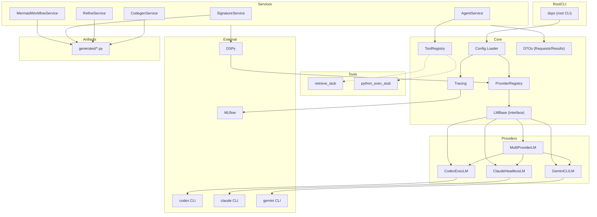
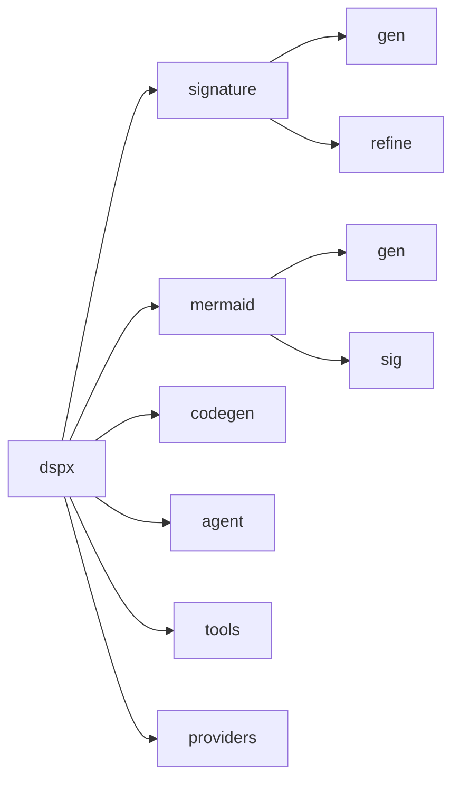
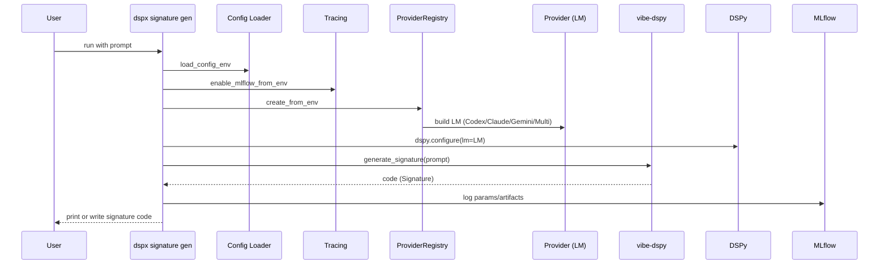
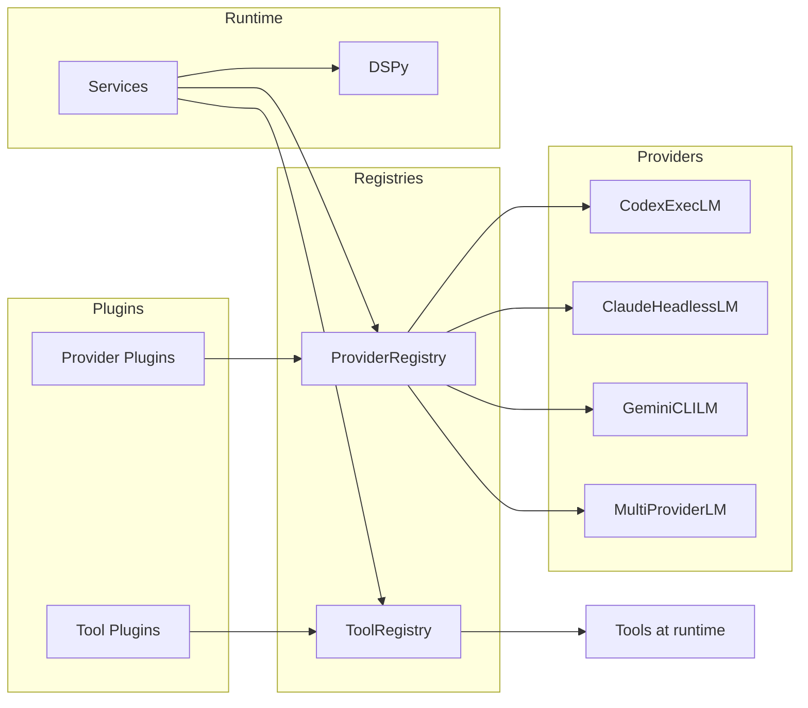
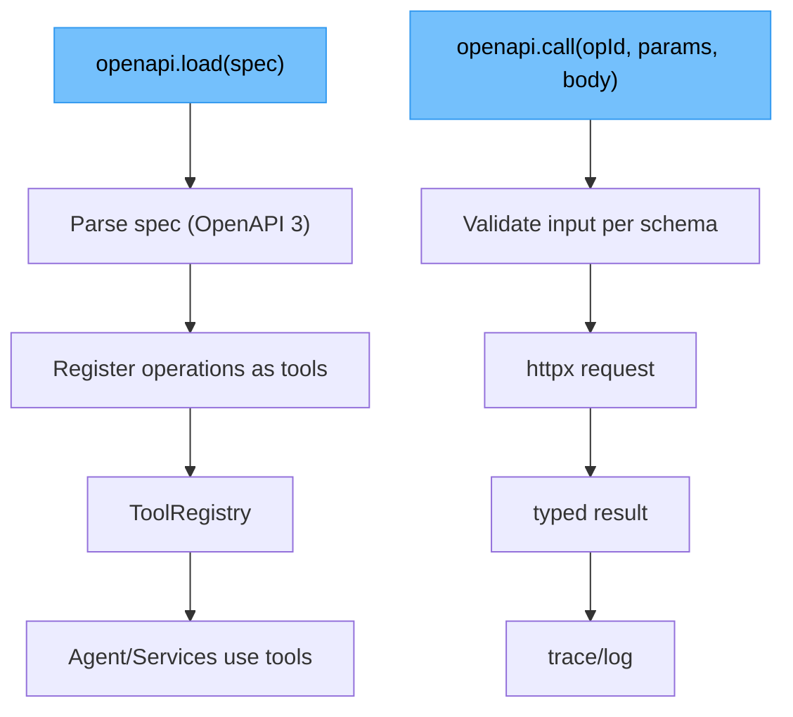

DSPx Architecture Overview
==========================

This document gives multiple “views” of the system to help contributors and users quickly build a mental model. These diagrams complement docs/VISION.md (principles, roadmap).

1) Architecture Layers (Unified)
--------------------------------

2) Unified CLI Map
------------------

3) Signature Generation Sequence
--------------------------------

4) Plugin & Extension Points
----------------------------

5) OpenAPI Tooling Flow (proposed)
----------------------------------

6) Data Contracts (DTOs)
------------------------

