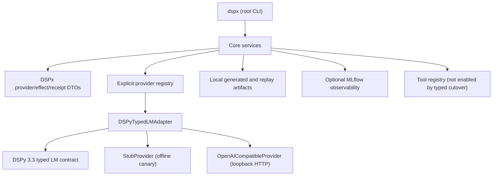
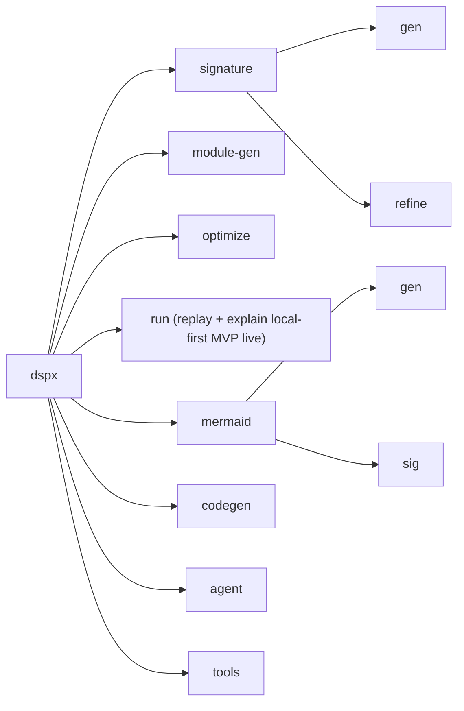
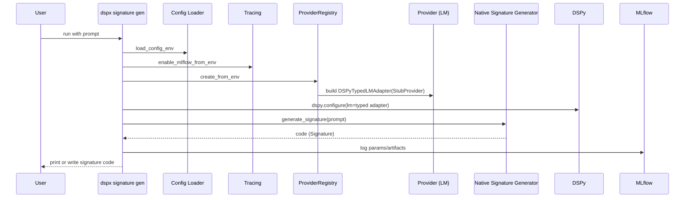
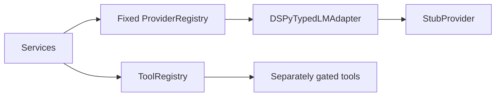
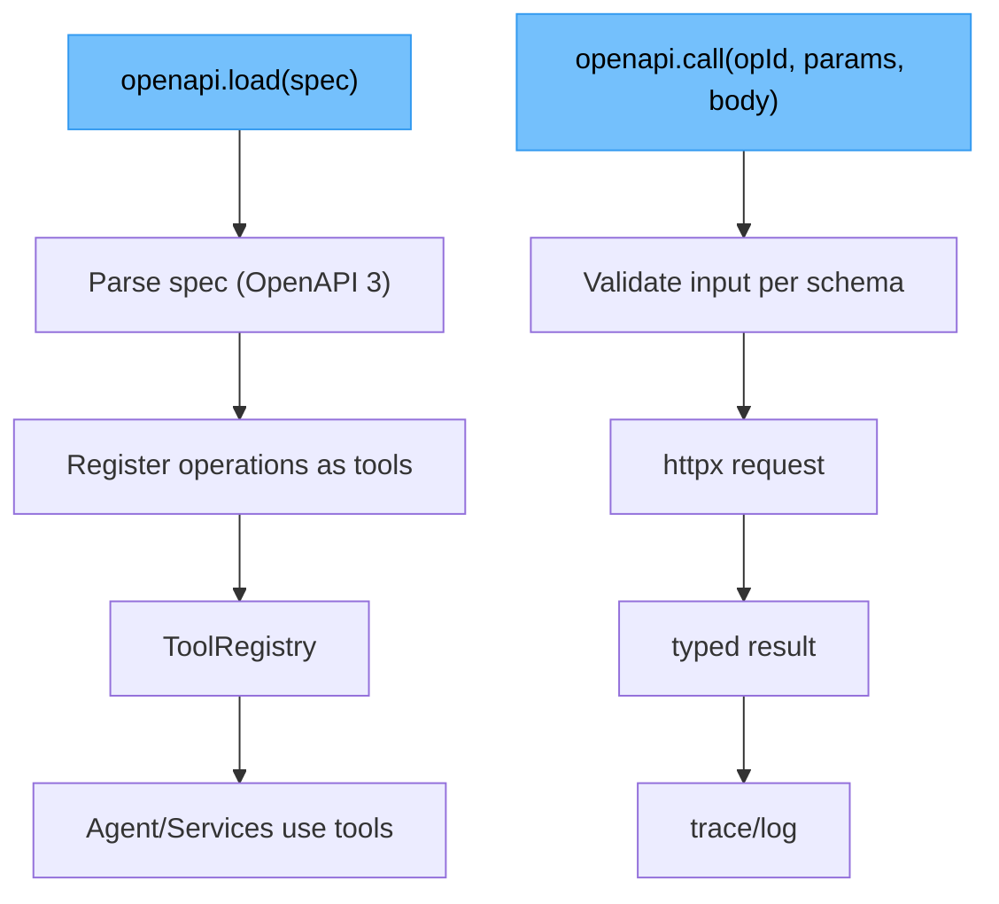
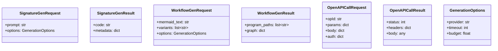

DSPx Architecture Overview
==========================

This document gives multiple “views” of the system to help contributors and users quickly build a mental model. These diagrams complement `docs/project/vision.md` (principles, roadmap).

1) Architecture Layers (Unified)
--------------------------------

The T3 support matrix contains the offline stub plus one IP-literal loopback HTTP
OpenAI-compatible transport. Providers are DSPx-owned ports and do not subclass DSPy;
exactly one adapter owns DSPy's typed lifecycle. Unsupported provider names fail before
effects, and no legacy provider bridge,
`LMBase`, fake response envelope, or `MultiProviderLM` remains on the active path.

Core vs App Boundary (current)
------------------------------

- Core package (`packages/dspx-core`) owns provider/runtime contracts, policy, replay/explain receipts, and generation/optimization services.
- `dspx.services.artifact_boundary` contains the small reusable artifact-envelope validation kernel. Its typed policy validates exact schema versions and fail-closed `non_authority` / `effect` flags; shared identity helpers distinguish incomplete from drifted identities; its confined-artifact primitive resolves paths before root checks (including symlink escape), verifies expected names, existence, and SHA-256 freshness. Consumers retain domain status rules and error types. The kernel validates existing artifacts in memory and does not create sidecars or grant authority.
- Service boundaries must stay truthful: `module_service` is now the stable module-generation facade, while narrower module-owned files hold deterministic artifact rendering (`module_artifacts`), module synthesis runtime orchestration (`module_synthesis_runtime`), advisory evidence retrieval (`module_synthesis_evidence`), and governance-only diagnostics (`module_governance`). Richer multi-artifact program synthesis belongs behind `program_service` instead of being folded into module generation; within that boundary, intent DTO/loading lives in `program_intent`, shared naming/field contracts live in `program_contracts`, deterministic surface/harness rendering lives in `program_surfaces`, deterministic jury contracts live in `program_jury`, and promotion/adjudication shells live in `program_promotion` so materialization does not blur generation, evaluation planning, or authority. `program_service` remains the Candidate Assembly orchestration facade, while `program_execution_episode` now owns pure construction of the deterministic `program-execution-episode-v1` runtime object from facade-observed inputs; it does not run harnesses, write artifacts, invoke Oracle, or gain promotion authority. The measured hotspot map and guarded follow-on sequence live in `docs/project/runtime-object-decomposition-sequence.md`.
- Module evidence, Oracle neighbors, quality events, promotion shells, and governance diagnostics are evidence/advisory outputs only. They must not gain live ranking, pruning, promotion, or external authority without a separate explicit contract.
- Verdict vocabulary and cross-owner handoffs are centralized in `docs/project/dspx-verdict-classification-and-source-owner-contract.md`. In particular, DSPx `semantic` benchmark terminology denotes empirical-quality evidence and must not be reinterpreted as ROCS conformance, publication, activation, or AK lifecycle truth.
- `program-gen` now emits `module_surfaces.json` (`program-module-surfaces-v1`) with one or more `program-module-surface-v1` contracts. These contracts make generated single-module scaffolds and generated topology modules first-class, hashable, replay-checked, IO-declared surfaces for composition. They are the bridge toward future local referenced custom module surfaces, but the current executable renderer still only materializes generated/native surfaces and does not import or execute arbitrary custom Python modules.
- `program-gen` can optionally emit local dataset split evidence when structured intent declares `dataset` (one JSONL/JSON/YAML file plus deterministic ratio split) or `datasets` (explicit train/validation/test files). This surface lives under `program_service` orchestration with a small dataset helper and keeps topology rendering unchanged: split files, `dataset_manifest.json`, split-specific eval harnesses, and `behavior_results.<split>.json` are evidence artifacts, not topology nodes, search inputs, promotion signals, Oracle authority, or external mutations.
- Longer-range architecture should be read as a behavior-first runtime for empirical evolution of DSPy systems: candidate assemblies run through bounded execution episodes, emit replayable receipt bundles, and later feed Oracle-derived behavioral phenotype and territory/frontier interpretation back into bounded search shaping, while preserving the authority split between DSPx runtime contracts, Oracle empirical analysis, and downstream governance/promotion surfaces. The first program-scoped foothold is intentionally narrow: `program-gen` writes a standalone `execution_episode.json` (`program-execution-episode-v1`) contract and a standalone `module_surfaces.json` (`program-module-surfaces-v1`) contract, and, when examples are present, local `behavior_results.json` evidence plus a compact `oracle_evidence.json` readability contract; when datasets are declared, it also writes `dataset_manifest.json`, deterministic split JSONL files, split-specific eval harnesses, and `behavior_results.<split>.json` evidence. It records their hashes/summaries/facets in the manifest and receipt without calling Oracle or granting ranking, pruning, jury, governance, or promotion authority. `program-intent-v2` can now carry explicit user/Pi-declared topology as a planning contract with bounded kinds, module IDs, `primitive` names, `signature.name` / `signature.inputs` / `signature.outputs`, and edges. The topology is validated and preserved in intent, plan, manifest, execution episode, module-surface contracts, and receipt metadata as declared input; the current renderer materializes bounded `pipeline`, `router`, `retrieve_then_answer`, `extract_transform_validate`, and `generate_critique_revise` subsets with deterministic DAG scheduling, `Predict` / `ChainOfThought`, bounded no-tool `ReAct`, sandboxed `ProgramOfThought`, and inline or materialization-time local-corpus retrievers. Dataset support does not infer or widen topology. This is not provider-backed arbitrary topology inference or a broad graph/effect engine: unsupported topology kinds remain declared-only, custom imports and live external tools/retrievers remain blocked, and no generated behavior acquires Oracle ranking, promotion, or external-authority power. A separate `oracle index --from-program-evidence` command can ingest those readability artifacts into a local CoordinateIndex as searchable `program-oracle-evidence` records, a separate `oracle program-evidence report` command can summarize those indexed records as example-backed behavioral interpretation, and a separate `program-refine propose` command can consume the manifest, declared behavior evidence, and that non-authoritative report to write a local `program-refinement-proposal-v1` artifact. A separate `program-promote review` command can then consume the manifest, original local promotion shell artifacts, declared behavior evidence, explicit Oracle report, and explicit refinement proposal to write a `program-promotion-review-refined-v1` sidecar packet for local adjudication review. A separate `program-promote jury` command can consume the manifest, planned jury artifacts, and current `eval_examples.py` / `behavior_results.json` evidence to write a local deterministic `program-jury-results-v2` sidecar without model calls, candidate mutation, ranking, winner selection, promotion, Oracle indexing, AK, or governance effects. A separate `program-promote decide` command can record explicit local operator/adjudicator input against that refined packet as a `program-promotion-decision-record-v1` sidecar. A separate `program-refine generate-candidate` command can then consume a proposed refinement plus a local `request_more_evidence` decision record and materialize one explicit local second candidate with refinement lineage. A separate `program-refine compare-candidates` command can compare two already-materialized `program-candidate-assembly-v1` manifests by reading their current `eval_examples.py` / `behavior_results.json` evidence and writing a local `program-refinement-candidate-comparison-v1` sidecar with status/count/failure-signal deltas. A separate `program-refine generate-and-compare` command is a thin explicit operator workflow that performs exactly that one second-candidate generation followed by the same local comparison sidecar. A separate `program-promote plan` command can consume an existing candidate manifest, a local decision record, and a comparison sidecar to write one `program-promotion-plan-v1` sidecar with `planned_not_applied` / `not_promoted` posture, target, authority owner, eligibility, evidence hashes, audit trail, and reversibility fields. A separate `adapters authority agent-kernel-export-preflight` command can consume a manifest, an explicit opaque AK ref, and optional decision/comparison sidecars to write one local `program-external-authority-export-preflight-v1` packet. That packet records input schemas/hashes, manifest identity, deterministic idempotency/export ID, an `ak_task_evidence_attachment` planned payload, failure-model states, and effect/non-authority flags proving no AK call, no external mutation, no governance mutation, no promotion, and no winner selection; actual apply remains unavailable and blocked on exact AK target binding, external duplicate checks, apply receipts, and rollback/failure semantics. A separate `program-promote status` command can then read the manifest plus any local sidecars and write one `program-candidate-state-v1` truth-state summary that explains materialization, behavior evidence, Oracle readability/reporting, proposal/review/decision/jury-results/comparison/plan/preflight posture, artifact hashes, no-mutation effects, and remaining future-apply requirements. A separate `program-refine optimize-gepa` command can consume an existing manifest plus explicit JSONL train/validation files, manifest dataset splits, or limited inline examples and write a `program-refinement-gepa-result-v1` sidecar; the GEPA optimizer may complete as local DSPy optimizer output, and the separate explicit `program-refine materialize-gepa-candidate` path can revalidate a ready sidecar and produce one local non-authoritative candidate assembly with refreshed behavior evidence; this does not select a winner or apply promotion. These consumer seams are advisory/local only: review/jury/decision/comparison/planning/export-preflight/status/GEPA-refinement commands do not mutate generated program files or the refined review packet, second-candidate generation mutates only the requested new output directory, comparison does not generate another candidate, the generate-and-compare workflow does not generate a third candidate, and none of these seams overwrites producer-side promotion artifacts, ranks, selects winners, prunes, promotes, deploys, blocks via Oracle, applies authority, mutates governance, mutates AK, or automates program-gen. Non-promote decision outcomes keep `promotion_state_after_decision: not_promoted`; `program-promote plan` always keeps `allowed_for_apply: false` and requires a future apply surface before any external authority contract could exist. The export preflight likewise keeps `ready_for_future_apply: false` because external apply is not implemented and the target contract is not bound to the AK runtime. `program-promote status` only summarizes current local truth and also keeps `ready_for_future_apply: false`. `promote` fails closed unless `review_readiness.ready_for_adjudicator_review` is explicitly true, and even then would be local-only rather than external activation. Generated candidates now include source harnesses such as `eval_examples.py` plus bounded `eval_behavior.py` orchestration that writes `behavior_episode.json`. Materialization/replay success and behavior status remain separate; integrated workflow status cannot be `ok` when behavior evidence reports failed, error, or degraded.
- Apps (`apps/*`) are optional product surfaces (Forge first) that consume core APIs.
- Dependency direction is strict: `apps/* -> packages/dspx-core`; never reverse.
- Data rule: receipts/manifests are canonical for replay; MLflow is an optional observability sink for explainability.

2) Unified CLI Map
------------------

Forge commands live in the separate app CLI (`dspx-forge`, or `just forge ...`).

3) Signature Generation Sequence
--------------------------------

Current native internals (spec-first path):
- provider-capability-aware prompt strategy (JSON-mode vs non-JSON-mode providers),
- stage A: model emits structured signature schema,
- stage B: deterministic renderer emits Python class code,
- validation + smoke checks + scoring,
- bounded retries with best-candidate selection,
- deterministic template fallback when validation fails,
- quality telemetry emission (`fallback_used`, attempts-used, validation/smoke pass rates) into JSONL,
- promotion-gate aggregation via `dspx signature quality-summary`.
- CI enforcement for provider corpus gates (artifact + PR-facing summary in `core` job).

4) Plugin & Extension Points
----------------------------

T2 has no provider-plugin registration surface. Each future transport provider must
land through its own reviewed additive restoration gate while retaining the sole
typed adapter and explicit effect custody.

5) OpenAPI Tooling Flow (proposed)
----------------------------------

6) Data Contracts (DTOs)
------------------------

7) Provider Runtime Mode (T3 operational view)
-----------------------------------------------

The supported matrix contains `DSPyTypedLMAdapter(StubProvider)` with model
`stub/echo` and `DSPyTypedLMAdapter(OpenAICompatibleProvider)` for explicit
IP-literal loopback HTTP endpoints. The HTTP provider is credential-free, synchronous,
text-only, non-redirecting, and non-retrying; external URLs, tools, streaming,
cancellation, native async, state, and copy remain unsupported. Explicit network-mutate
policy opt-in plus provider/capability checks are required before dispatch. Runtime
artifacts bind a maximum-64 secret-free attempt projection with one terminal effect and
zero-or-one dispatch per invocation. Unknown and removed provider names reject before
dispatch.

8) Provider Execution Semantics
-------------------------------

| Provider / mode | Runtime type | Retry behavior | Effect contract | Status |
| --- | --- | --- | --- | --- |
| Stub (`stub`) | DSPx provider port behind the sole typed adapter | Disabled (`num_retries=0`) | Unsupported input rejects before invocation; post-effect ambiguity becomes redacted `effect_indeterminate` | Supported offline canary |
| OpenAI-compatible (`openai-compatible`) | DSPx loopback HTTP port behind the sole typed adapter | One dispatch per attempt; redirects and retries disabled; indeterminate effects latch the instance terminally | Fully read non-2xx/malformed responses are `completed_failure`; transport/read ambiguity is redacted `effect_indeterminate`; bounded receipt evidence records count and truncation | Supported without credentials for IP-literal loopback HTTP only |
| Codex, Claude, Gemini, Pi RPC, OpenRouter, `dspy-lm-auth`, vLLM, Multi | None | None | Deterministic unsupported-provider error before effects | Removed; additive restoration requires a separate gate |

9) Replay vs Explain (data model)
---------------------------------

| Concern | Primary source of truth | Role of MLflow | Expected behavior when `MLFLOW_ENABLE=0` |
| --- | --- | --- | --- |
| Replay (reproducibility) | Run receipts/manifests/meta + cached artifacts | Optional mirror/index only | Replay still works from local artifacts/metadata |
| Explain (observability) | Runtime events, tags, metrics, artifacts | Primary UI/sink for traces and diagnostics | No MLflow calls; core output still produced |

Principle:
- Replay must not depend on MLflow internals or availability.
- MLflow should enrich explainability, not gate execution correctness.

10) Monorepo Package Topology (proposed)
----------------------------------------

| Path | Role | Must depend on | Must not depend on |
| --- | --- | --- | --- |
| `packages/dspx-core` | Canonical toolkit kernel for candidate surfaces/assemblies, execution episodes, receipts, providers, tools, policy, program synthesis, and optimization | Third-party libs only | `apps/*` |
| `packages/dspx-server` (optional split) | HTTP/API delivery surface over core services | `packages/dspx-core` | `apps/*` |
| `apps/forge` | Product workflow (backlog compiler / issue automation) | `packages/dspx-core` (+ forge-specific deps) | Any core-internal private module API |
| `apps/*` (future) | Additional products (run explorer, eval studio, etc.) | `packages/dspx-core` | Other app internals by default |

Guardrails:
- Keep core release criteria independent from app release cadence.
- Keep mutating product workflows out of core command critical path.
- Add contract tests so app upgrades validate against released core APIs.
