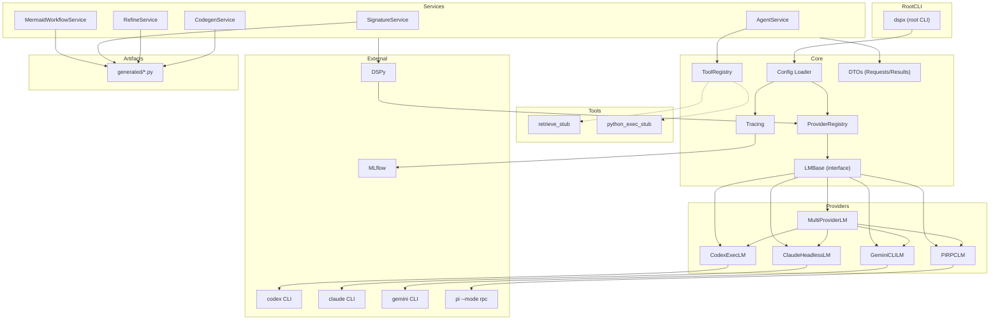
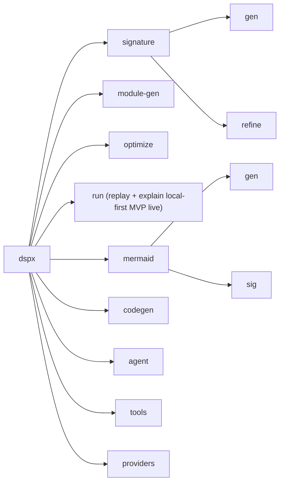
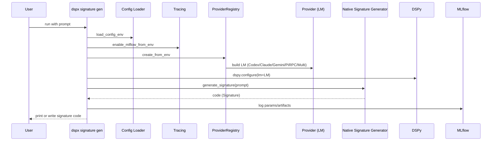
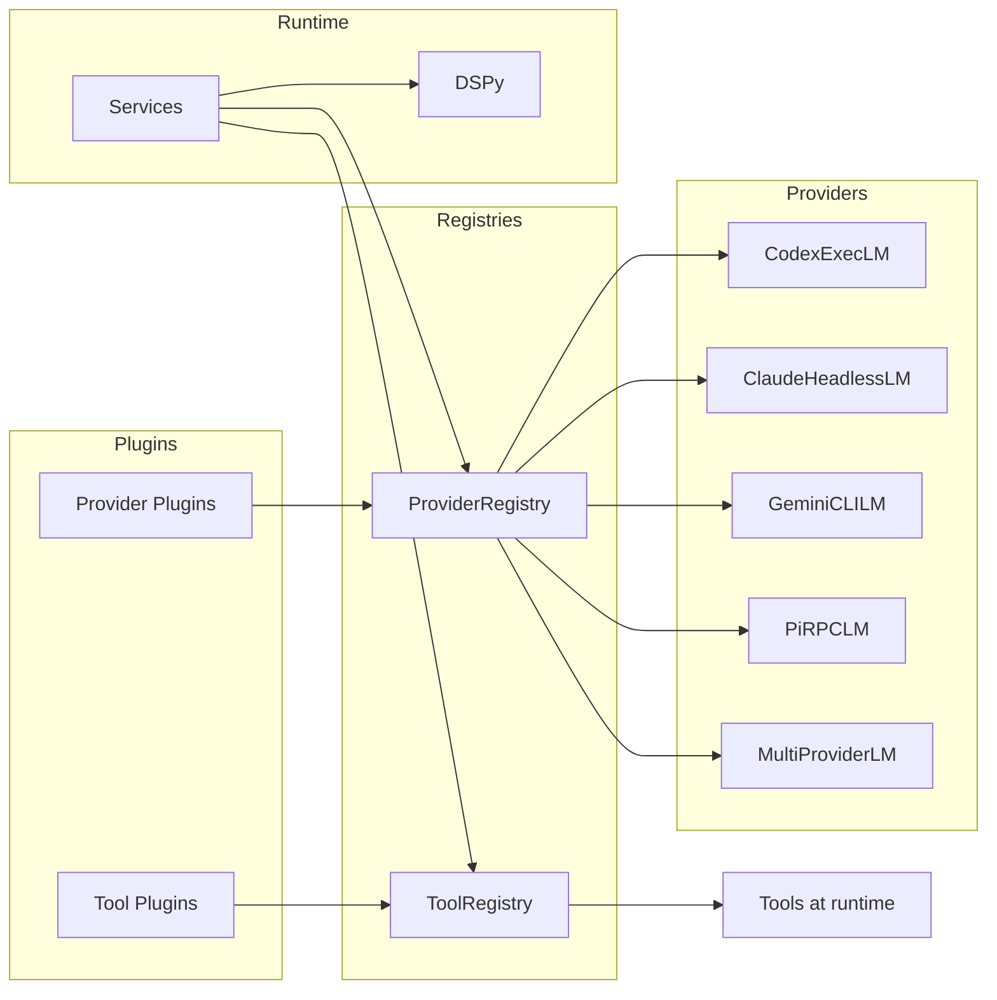
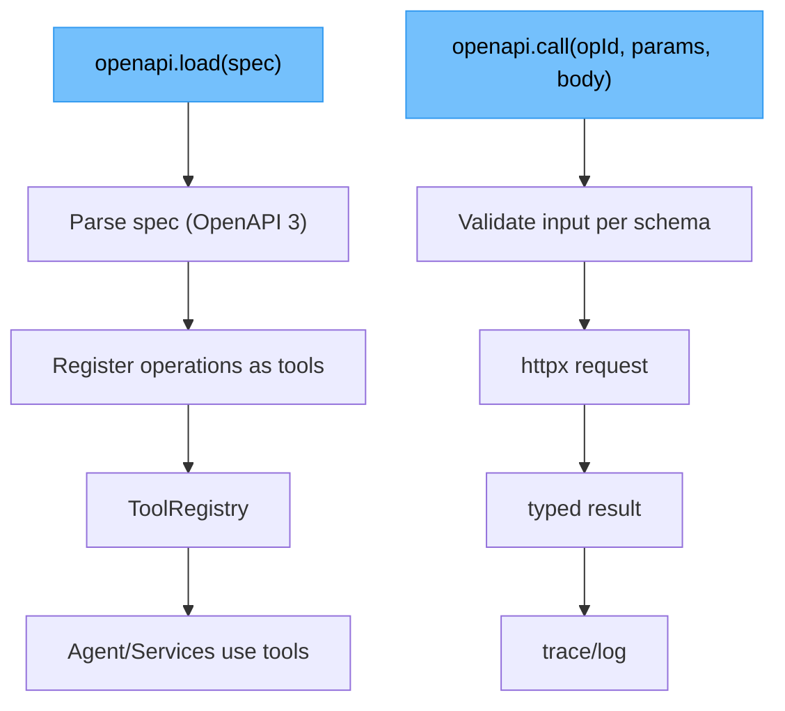
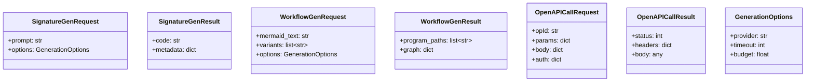

DSPx Architecture Overview
==========================

This document gives multiple “views” of the system to help contributors and users quickly build a mental model. These diagrams complement `docs/project/vision.md` (principles, roadmap).

1) Architecture Layers (Unified)
--------------------------------

Core vs App Boundary (current)
------------------------------

- Core package (`packages/dspx-core`) owns provider/runtime contracts, policy, replay/explain receipts, and generation/optimization services.
- Service boundaries must stay truthful: `module_service` is now the stable module-generation facade, while narrower module-owned files hold deterministic artifact rendering (`module_artifacts`), module synthesis runtime orchestration (`module_synthesis_runtime`), advisory evidence retrieval (`module_synthesis_evidence`), and governance-only diagnostics (`module_governance`). Richer multi-artifact program synthesis belongs behind `program_service` instead of being folded into module generation; within that boundary, intent DTO/loading lives in `program_intent`, shared naming/field contracts live in `program_contracts`, deterministic surface/harness rendering lives in `program_surfaces`, deterministic jury contracts live in `program_jury`, and promotion/adjudication shells live in `program_promotion` so materialization does not blur generation, evaluation planning, or authority.
- Module evidence, Oracle neighbors, quality events, promotion shells, and governance diagnostics are evidence/advisory outputs only. They must not gain live ranking, pruning, promotion, or external authority without a separate explicit contract.
- `program-gen` now emits `module_surfaces.json` (`program-module-surfaces-v1`) with one or more `program-module-surface-v1` contracts. These contracts make generated single-module scaffolds and generated topology modules first-class, hashable, replay-checked, IO-declared surfaces for composition. They are the bridge toward future local referenced custom module surfaces, but the current executable renderer still only materializes generated/native surfaces and does not import or execute arbitrary custom Python modules.
- `program-gen` can optionally emit local dataset split evidence when structured intent declares `dataset` (one JSONL/JSON/YAML file plus deterministic ratio split) or `datasets` (explicit train/validation/test files). This surface lives under `program_service` orchestration with a small dataset helper and keeps topology rendering unchanged: split files, `dataset_manifest.json`, split-specific eval harnesses, and `behavior_results.<split>.json` are evidence artifacts, not topology nodes, search inputs, promotion signals, Oracle authority, or external mutations.
- Longer-range architecture should be read as a behavior-first runtime for empirical evolution of DSPy systems: candidate assemblies run through bounded execution episodes, emit replayable receipt bundles, and later feed Oracle-derived behavioral phenotype and territory/frontier interpretation back into bounded search shaping, while preserving the authority split between DSPx runtime contracts, Oracle empirical analysis, and downstream governance/promotion surfaces. The first program-scoped foothold is intentionally narrow: `program-gen` writes a standalone `execution_episode.json` (`program-execution-episode-v1`) contract and a standalone `module_surfaces.json` (`program-module-surfaces-v1`) contract, and, when examples are present, local `behavior_results.json` evidence plus a compact `oracle_evidence.json` readability contract; when datasets are declared, it also writes `dataset_manifest.json`, deterministic split JSONL files, split-specific eval harnesses, and `behavior_results.<split>.json` evidence. It records their hashes/summaries/facets in the manifest and receipt without calling Oracle or granting ranking, pruning, jury, governance, or promotion authority. `program-intent-v2` can now carry explicit user/Pi-declared topology as a planning contract with bounded kinds, module IDs, `primitive` names, `signature.name` / `signature.inputs` / `signature.outputs`, and edges. The topology is validated and preserved in intent, plan, manifest, execution episode, module-surface contracts, and receipt metadata as declared input; the current renderer materializes the narrow explicit `pipeline` subset with `Predict` and `ChainOfThought` modules plus simple `when.field`/`when.equals` routing. Dataset support does not infer or widen topology. This is not automatic topology inference and not a broad graph engine: unsupported topology kinds remain declared-only, and no custom imports, tools, retrievers, ReAct, ProgramOfThought, arbitrary expressions, model-jury execution, GEPA/search automation, Oracle indexing, or promotion authority are introduced. A separate `oracle index --from-program-evidence` command can ingest those readability artifacts into a local CoordinateIndex as searchable `program-oracle-evidence` records, a separate `oracle program-evidence report` command can summarize those indexed records as example-backed behavioral interpretation, and a separate `program-refine propose` command can consume the manifest, declared behavior evidence, and that non-authoritative report to write a local `program-refinement-proposal-v1` artifact. A separate `program-promote review` command can then consume the manifest, original local promotion shell artifacts, declared behavior evidence, explicit Oracle report, and explicit refinement proposal to write a `program-promotion-review-refined-v1` sidecar packet for local adjudication review. A separate `program-promote jury` command can consume the manifest, planned jury artifacts, and current `eval_examples.py` / `behavior_results.json` evidence to write a local deterministic `program-jury-results-v1` sidecar without model calls, candidate mutation, ranking, winner selection, promotion, Oracle indexing, AK, or governance effects. A separate `program-promote decide` command can record explicit local operator/adjudicator input against that refined packet as a `program-promotion-decision-record-v1` sidecar. A separate `program-refine generate-candidate` command can then consume a proposed refinement plus a local `request_more_evidence` decision record and materialize one explicit local second candidate with refinement lineage. A separate `program-refine compare-candidates` command can compare two already-materialized `program-candidate-assembly-v1` manifests by reading their current `eval_examples.py` / `behavior_results.json` evidence and writing a local `program-refinement-candidate-comparison-v1` sidecar with status/count/failure-signal deltas. A separate `program-refine generate-and-compare` command is a thin explicit operator workflow that performs exactly that one second-candidate generation followed by the same local comparison sidecar. A separate `program-promote plan` command can consume an existing candidate manifest, a local decision record, and a comparison sidecar to write one `program-promotion-plan-v1` sidecar with `planned_not_applied` / `not_promoted` posture, target, authority owner, eligibility, evidence hashes, audit trail, and reversibility fields. A separate `adapters authority agent-kernel-export-preflight` command can consume a manifest, an explicit opaque AK ref, and optional decision/comparison sidecars to write one local `program-external-authority-export-preflight-v1` packet. That packet records input schemas/hashes, manifest identity, deterministic idempotency/export ID, an `ak_task_evidence_attachment` planned payload, failure-model states, and effect/non-authority flags proving no AK call, no external mutation, no governance mutation, no promotion, and no winner selection; actual apply remains unavailable and blocked on exact AK target binding, external duplicate checks, apply receipts, and rollback/failure semantics. A separate `program-refine optimize-gepa` command can consume an existing manifest plus explicit JSONL train/validation files, manifest dataset splits, or limited inline examples and write a `program-refinement-gepa-result-v1` sidecar; the current GEPA optimizer may complete as local DSPy optimizer output, but that output is not yet a `program-candidate-assembly-v1`, so the sidecar degrades truthfully with `candidate: null` unless a real candidate materializer exists. These consumer seams are advisory/local only: review/jury/decision/comparison/planning/export-preflight/GEPA-refinement commands do not mutate generated program files or the refined review packet, second-candidate generation mutates only the requested new output directory, comparison does not generate another candidate, the generate-and-compare workflow does not generate a third candidate, and none of these seams overwrites producer-side promotion artifacts, ranks, selects winners, prunes, promotes, deploys, blocks via Oracle, applies authority, mutates governance, mutates AK, or automates program-gen. Non-promote decision outcomes keep `promotion_state_after_decision: not_promoted`; `program-promote plan` always keeps `allowed_for_apply: false` and requires a future apply surface before any external authority contract could exist. The export preflight likewise keeps `ready_for_future_apply: false` because external apply is not implemented and the target contract is not bound to the AK runtime. `promote` fails closed unless `review_readiness.ready_for_adjudicator_review` is explicitly true, and even then would be local-only rather than external activation. The current behavior harness remains `eval_examples.py`; there is no `eval_behavior.py` orchestration layer yet.
- Apps (`apps/*`) are optional product surfaces (Forge first) that consume core APIs.
- Dependency direction is strict: `apps/* -> packages/dspx-core`; never reverse.
- Data rule: receipts/manifests are canonical for replay; MLflow is an optional observability sink for explainability.

2) Unified CLI Map
------------------

Forge commands live in the separate app CLI (`dspx-forge`, or `just forge ...`).

3) Signature Generation Sequence
--------------------------------

Current native internals (spec-first path):
- provider-capability-aware prompt strategy (JSON-mode vs non-JSON-mode providers),
- stage A: model emits structured signature schema,
- stage B: deterministic renderer emits Python class code,
- validation + smoke checks + scoring,
- bounded retries with best-candidate selection,
- deterministic template fallback when validation fails,
- quality telemetry emission (`fallback_used`, attempts-used, validation/smoke pass rates) into JSONL,
- promotion-gate aggregation via `dspx signature quality-summary`.
- CI enforcement for provider corpus gates (artifact + PR-facing summary in `core` job).

4) Plugin & Extension Points
----------------------------

5) OpenAPI Tooling Flow (proposed)
----------------------------------

6) Data Contracts (DTOs)
------------------------

7) Provider Runtime Modes (operational view)
--------------------------------------------

- One-shot CLI subprocess per call: Codex/Claude/Gemini wrappers.
- Persistent RPC subprocess: PiRPC (`pi --mode rpc`) to reduce startup overhead
  across repeated provider calls.
- HTTP provider: OpenRouter over an OpenAI-compatible API.

This distinction matters for reliability and policy:
- one-shot mode is simpler to recover but pays startup cost per call,
- persistent RPC needs lifecycle/timeout/restart handling,
- HTTP mode depends on network/policy controls and request validation.

8) Provider Execution Semantics
-------------------------------

| Provider / mode | Runtime type | Startup overhead | Timeout behavior | Retry/restart behavior | Policy surface | Typical failure modes |
| --- | --- | --- | --- | --- | --- | --- |
| Codex (`codex-exec`) | One-shot CLI subprocess | High per call (binary startup + prompt handoff) | Per-call subprocess timeout; hard kill on overrun | Retry by re-invocation; no retained session state | Capability checks (`code.exec`), bypass/sandbox knobs, env allow/deny filtering | CLI missing, auth/session expiry, model errors, non-zero exit with partial output |
| Claude (`claude-cli`) | One-shot CLI subprocess | High per call | Per-call timeout on subprocess collect | Retry by re-invocation; no process reuse | Tool allow/deny lists, permission mode, capability checks | CLI missing, permission/tool mismatch, CLI output-format drift, timeout |
| Gemini (`gemini-cli`) | One-shot CLI subprocess | Medium-high per call | Per-call timeout on subprocess collect | Retry by re-invocation | Capability checks + optional extra flags/env | CLI missing, auth/config issues, transient CLI failures |
| PiRPC (`pi-rpc`) | Persistent RPC subprocess (`pi --mode rpc`) | One-time warm start; low steady-state per call | Per-request timeout plus transport-level timeout guards | Restart subprocess on broken pipe/hang; retries after restart are explicit | Capability checks, pi safety env defaults (`DSPX_PI_NO_TOOLS`, etc.) | RPC desync, transport timeout, subprocess crash, stale session state |
| OpenRouter (`openrouter`) | HTTP API (OpenAI-compatible) | Low (no local process startup) | HTTP client timeout (connect/read/write) per request | Retry/backoff at caller policy; no local process restart | `network.read` / `network.mutate`, method allow/deny, host allowlist | 401/403 auth, 429 throttling, 5xx upstream errors, schema mismatch |
| Multi (`multi`) | Composite orchestrator over child providers | Depends on strategy (`sequential_first` sums, `parallel_first` overlaps) | Child provider timeouts + strategy-level completion policy | Delegates retry/restart to children; optional early-abort on validation | Aggregated policy knobs (`policy_bypass`, allowed/disallowed tools), isolation mode controls | Partial child failures, nondeterministic winner timing, uncancellable background CLI work |

9) Replay vs Explain (data model)
---------------------------------

| Concern | Primary source of truth | Role of MLflow | Expected behavior when `MLFLOW_ENABLE=0` |
| --- | --- | --- | --- |
| Replay (reproducibility) | Run receipts/manifests/meta + cached artifacts | Optional mirror/index only | Replay still works from local artifacts/metadata |
| Explain (observability) | Runtime events, tags, metrics, artifacts | Primary UI/sink for traces and diagnostics | No MLflow calls; core output still produced |

Principle:
- Replay must not depend on MLflow internals or availability.
- MLflow should enrich explainability, not gate execution correctness.

10) Monorepo Package Topology (proposed)
----------------------------------------

| Path | Role | Must depend on | Must not depend on |
| --- | --- | --- | --- |
| `packages/dspx-core` | Canonical toolkit kernel for candidate surfaces/assemblies, execution episodes, receipts, providers, tools, policy, program synthesis, and optimization | Third-party libs only | `apps/*` |
| `packages/dspx-server` (optional split) | HTTP/API delivery surface over core services | `packages/dspx-core` | `apps/*` |
| `apps/forge` | Product workflow (backlog compiler / issue automation) | `packages/dspx-core` (+ forge-specific deps) | Any core-internal private module API |
| `apps/*` (future) | Additional products (run explorer, eval studio, etc.) | `packages/dspx-core` | Other app internals by default |

Guardrails:
- Keep core release criteria independent from app release cadence.
- Keep mutating product workflows out of core command critical path.
- Add contract tests so app upgrades validate against released core APIs.
