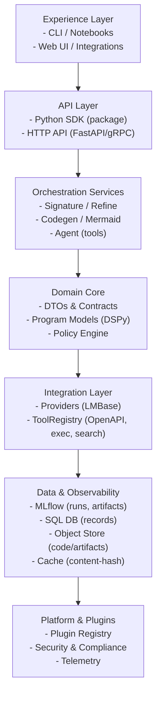
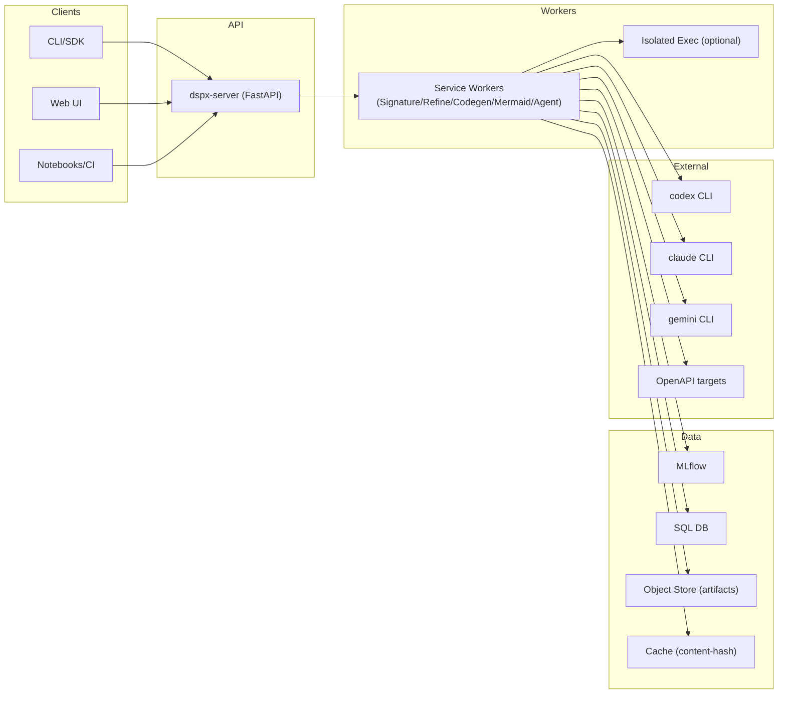

DSPx Vision (First Principles, Durable Design)
=============================================

Why this exists
---------------
We want a durable, composable stack for LM-driven programming that: (a) treats the LM as a pluggable runtime (providers/capabilities), (b) exposes high‑leverage services (signatures, refine, codegen, workflows, agents), (c) is safe, observable, and reproducible, and (d) is easy to extend via plugins (providers/tools/generators).

First principles
----------------
- Explicit contracts over implicit prompts: define DTOs for requests/results; keep services pure and testable.
- Providers are interchangeable: a tiny LMBase interface with capabilities (json, code_exec, tools, multi_turn).
- Orchestration lives in services: CLIs are thin; services compose providers/tools/DSLs (e.g., Mermaid).
- Safety and policy by default: allowlists, budgets, and permission gates for tool‑calling and network access.
- Observability as a feature: MLflow logs for inputs, outputs, decisions, artifacts, and cost/time budgets.
- Reproducibility: content‑hash inputs + options; write run metadata next to artifacts; support caching.
- Extensibility: register providers/tools/plugins with capabilities; version contracts (DTOs v1, v2…).

Layers
------
- Core
  - Config: `load_config_env` discovers config.toml/env; policy flags; workdir discovery.
  - Tracing: `enable_mlflow_from_env` for observability; tags for provider/model/budget.
  - DTOs: typed, versioned inputs/outputs (SignatureGenRequest/Result, CodegenRequest/Result, WorkflowGenRequest/Result, OpenAPICallRequest/Result, etc.).
  - LMBase + ProviderRegistry + Capabilities: minimal interface + factory registry + capability bitset.
  - ToolRegistry: tool descriptors + policies (allowlisted hosts, timeouts, redaction).

- Providers
  - CodexExecLM, ClaudeHeadlessLM, GeminiCLILM, MultiProviderLM.
  - Capability probing (json/tool/exec/multi_turn) steers service behavior.

- Services
  - SignatureService: prompt → Signature code (vibe‑dspy), returns CodeArtifact.
  - RefineService: draft Signature → improved Signature (interactive or non‑interactive).
  - CodegenService: spec → code (general purpose generators/templates).
  - MermaidWorkflowService: Mermaid → DSPy programs (predict/cot/react) or signature‑per‑node.
  - AgentService: ReAct/tools orchestration; plans, retries, budgets, tool choice.

- Programs/Modules
  - Reusable DSPy modules (clarity/sixe/react variant); used by generated programs.

- Storage/Artifacts
  - Filesystem for generated/*.py; SQL/MLflow for traces and structured outcomes.

DSPy Pillars Alignment
----------------------
This project maps cleanly onto DSPy's five pillars and adds missing pieces where useful:

- Signatures
  - Status: covered by SignatureService (prompt → Signature code), typed via SignatureGenRequest/Result.
  - Next: keep generator prompts/templates centralized and versioned.

- Modules
  - Rationale: modules are reusable DSPy components; different from full programs.
  - Action: introduce ModuleService with DTOs ModuleSpec → ModuleArtifact.
  - Use: generated modules can be optimized, reused across programs, and unit tested.

- Optimizers
  - Rationale: DSPy teleprompters (BootstrapFewShot, MIPRO, Refine) tune modules/programs.
  - Action: add OptimizeService with OptimizationRequest/Result; take ModuleArtifact or ProgramArtifact + dataset/eval adapters.

- Adapters
  - Rationale: environment/data connectors used by services/optimizers (not runtime “tools”).
  - Action: introduce Adapter registry/types for datasets (HF/CSV/Parquet/MLflow), stores (MLflow/SQL/object), eval/metrics, embeddings/index.

- Tools
  - Status: ToolRegistry with stubs (retrieve, python exec, repo/db/kb/ontology); add OpenAPI Toolpack.
  - Policy: host allowlists, budgets, redaction; capabilities tagged (network/read-only/destructive).

Programs vs. Modules
--------------------
- Programs: runnable workflows (scripts) composed of modules and control-flow (e.g., Mermaid outputs).
- Modules: reusable DSPy Module classes encapsulating signatures/logic.
- Decision: keep WorkflowGen (Mermaid) for program composition, but emit typed ProgramGraph and ProgramArtifact. Provide optional node→module mapping and call ModuleService/SignatureService under the hood for signature-per-node.

DTOs (v1) Catalog
------------------
- SignatureGenRequest/Result
- ModuleSpec/ModuleArtifact
- ProgramGraphSpec/ProgramArtifact (from Mermaid and other sources)
- OptimizationRequest/OptimizationResult (optimizer name, dataset/eval, objective/metrics, checkpoints)
- ToolDescriptor (id, schema, capabilities)
- AdapterDescriptor (type, source/config)
- OpenAPISpecDescriptor/OpenAPIOperation/OpenAPICallRequest/Result

Services (target) Catalog
-------------------------
- SignatureService: prompt → Signature code
- ModuleService: spec → Module skeleton(s) (optionally using Signatures)
- OptimizeService: optimize Modules/Programs with DSPy teleprompters
- CodegenService: spec → code artifacts (non-signature)
- MermaidWorkflowService: diagram → ProgramGraph + ProgramArtifact; optional per-node modules/signatures
- AgentService: ReAct/tool orchestration; integrates ToolRegistry + Providers

CTO Layered Architecture
------------------------

Deployment View & Boundaries
----------------------------

OpenAPI Toolpack (proposed)
---------------------------
Goal: treat OpenAPI specs as a dynamic tool source.
- Loader: `openapi.load(spec)` parses and registers operations as tools in ToolRegistry.
- Caller: `openapi.call(opId, params, body)` validates and executes via HTTPX; enforces allowlisted hosts and budgets.
- DTOs: OpenAPISpecDescriptor, OpenAPIOperation, OpenAPICallRequest/Result.
- CLI: `dspx tools openapi load|ops|call` with safe defaults (host allowlists, redacted tokens).
- Integration: AgentService can pick OpenAPI tools; Mermaid nodes can map to operations.

Unified CLI (target)
--------------------
- Root: `dspx` with subcommands (keep current scripts as forwarders during transition):
  - `dspx signature gen|refine` (vibe)
  - `dspx mermaid gen|sig` (variants vs. signature‑per‑node)
  - `dspx codegen run` (spec → code)
  - `dspx agent run` (tool‑augmented reasoning)
  - `dspx tools openapi ...` and `dspx tools list|run`
  - `dspx providers list|capabilities`
- Shared flags: `--provider`, `--model`, `--mlflow-enable`, `--timeout`, `--cwd`, policy flags (`--bypass-permissions`, `--allowed-tools`, `--disallowed-tools`).

Security, policy, safety
------------------------
- Host allowlists + path constraints for network tools (OpenAPI, webfetch).
- Token handling: env scoping, redaction in logs, short‑lived tokens.
- Permissions: explicit prompts for destructive ops; budget/time gates; dry‑run modes.
- Sandboxing: optional isolated worktrees/processes for code‑exec providers.

Observability, reproducibility, and performance
----------------------------------------------
- MLflow: record inputs/options/artifacts; set tags (provider, model, cost); attach previews.
- Caching: content hash of inputs + options; artifact reuse; negative caching for failures.
- Budgets: per‑service time/cost caps with graceful degradation and logs.

Testing strategy
----------------
- Stub LM (LMBase) for service unit tests; golden tests for Mermaid/Signature outputs with frozen prompts.
- CLI smoke tests (no external providers), runtime under ~3s.
- Type‑checking and linting in CI; pre‑commit for formatting.

Implementation Plan (phased)
----------------------------

Phase 0 — Stabilize & Document
- Align docs and diagrams; build/tests green (<3s local). Deliver README, VISION (this), ARCHITECTURE, OPENAPI_TOOLING.

Phase 1 — Contracts & Abstractions
- Introduce LMBase + ProviderCapabilities; add DTOs (v1) including Modules/Programs; add StubLM. Unit tests run with no external providers.

Phase 2 — Template Library
- Centralize prompts/templates for Signatures/Codegen with version tags; golden tests stable.

Phase 3 — ModuleService (MVP)
- Implement ModuleService from ModuleSpec → ModuleArtifact (optionally via Signatures). Add unit tests (StubLM).

Phase 4 — Unified CLI (skeleton)
- Scaffold `dspx` CLI (Typer): `signature gen|refine`, `module gen`, `mermaid gen|sig`. Keep existing script forwarders.

Phase 5 — OpenAPI Toolpack (MVP)
- Loader + caller + CLI; host allowlists; basic tracing/redaction. Demonstrate with GitHub spec.

Phase 6 — Caching & Repro Metadata
- Content-hash cache for generation; write metadata next to artifacts. Toggleable via config.

Phase 7 — Adapter Registry (datasets/eval/stores)
- Define adapter types + registry. Provide CSV/Parquet loader, MLflow dataset reference, simple metrics.

Phase 8 — Server API (optional)
- FastAPI `dspx-server` for `/signature`, `/module`, `/mermaid` endpoints; basic auth.

Phase 9 — Policy, Safety, Sandboxing
- Policy engine for tool/provider gating; optional isolated worktrees; time/cost budgets and logs.

Phase 10 — Plugins & Extension Points
- Entry points for providers/tools/generators; plugin guide + example plugin.

Success Metrics
---------------
Tools Catalog (initial)
-----------------------
Curated toolpacks registered via ToolRegistry with capability tags and policy gates. All tools honor budgets/timeouts and redact sensitive data in logs.

- OpenAPI (network.readonly|network.mutate)
  - Loader/caller with host allowlists and schema validation.
  - CLI: `dspx tools openapi load|ops|call`.

- Web fetch/scrape (network.readonly)
  - `fetch(url)`: httpx GET with status/headers/meta; size caps.
  - `scrape(url, selector?)`: fetch + bs4 extraction; optional CSS selector.
  - CLI: `dspx tools web fetch|scrape`.

- Python exec (code.exec)
  - Execute small Python snippets with sandboxing/timeouts; disabled by default; opt-in per policy.
  - CLI: `dspx tools py exec --code 'print(1)'` (local/testing only).

- Repo/DB/KB/Ontology summarizers (filesystem.read | db.read)
  - `repo_summary(path)`: structural/code summary with ripgrep and heuristics.
  - `db_schema()`: reflect schema from allowlisted DSN; redact PII; read-only.
  - `kb_summary(path)`: summarize docs under path; optional embeddings.
  - `ontology_summary(path)`: synthesize domain model overview from code/docs.

- Code search/write (filesystem.read|filesystem.write) — gated/dangerous
  - `code_search(query, path)`: ripgrep-backed search with allowlisted patterns.
  - `code_write(path, patch)`: apply constrained patches; requires explicit allowlist + dry-run.

- Data preview (filesystem.read)
  - `preview(path, nrows)`: show schema + head for CSV/JSON/Parquet with size/time caps.

Capability tags (examples): `network.readonly`, `network.mutate`, `code.exec`, `filesystem.read`, `filesystem.write`, `db.read`, `db.write`.

Adapters Catalog (initial)
--------------------------
Environment/data connectors used by services/optimizers (contrast with runtime tools). Registered with types and validated configuration.

- Datasets
  - HF datasets, CSV/Parquet loaders, MLflow dataset references.
- Stores
  - MLflow (runs/artifacts), SQL (records), Object store (code/artifacts), Cache (content-hash).
- Evaluation/Metrics
  - Accuracy/F1/ROUGE/BLEU + custom scorers; pluggable.
- Index/Embeddings (optional)
  - chromadb/weaviate/pinecone adapters for retrieval/eval workflows.
- Provider/Tracer
  - Existing ProviderRegistry/Capabilities; tracing adapters for MLflow/logging.

CLI/SDK exposure (tools/adapters)
---------------------------------
- Tools: `dspx tools list|run`, `dspx tools openapi ...`, `dspx tools web ...`, `dspx tools py ...`.
- Adapters: `dspx adapters list|add|describe` (optional), SDK helpers to instantiate adapters from config.

Success Metrics
---------------
- DX: unified CLI helps new users complete a task in <5 minutes.
- Tests: unit tests (no external deps) <2s; full smoke <5s.
- Repro: cache hit rate >70% in CI; artifacts tagged with inputs/options.
- Safety: no requests to non‑allowlisted hosts in CI; secrets redacted.
- Extensibility: external provider/tool plugin authored in <50 lines and loaded via entry point.

Risks and higher‑order effects
------------------------------
- 2nd order: unified CLI reduces learning curve → more adoption.
- 3rd order: plugin ecosystem emerges → maintain versioned capability contracts.
- 4th order: API drift in OpenAPI tools → pin spec versions + smoke tests.
- 5th order: cost/latency variability → enforce budgets/backoff/caches.
- 6th order: compliance/security pressure → improve policy, audit logs, redaction.

Current state
-------------
- Codex/Claude/Gemini providers + vibe‑dspy adapters work; MLflow tracing + config are in place.
- Mermaid variants and signature‑per‑node flows generate runnable programs.
- Next steps are additive; back‑compat maintained via forwarders while unifying CLI.
